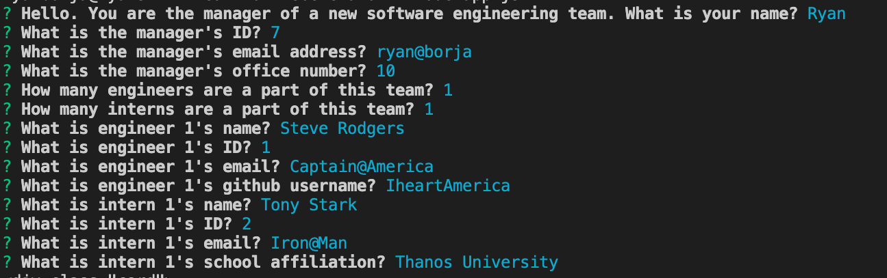

# Team Profile Generator

## Description

The Team Profile Generator is designed for a team manager to make a profile page for their team based on the number and info of their interns and engineers. The manager will be able to choose how many interns and engineers he or she would like to have on the team.

## Getting Started

#### First, the user, the manager of the team, our asked questions.

The manager is asked their name, manager ID, email, and office number. They are then asked how many interns and engineers are on their team.

#### Then, the manager is asked about their team member's info.

The manager is first asked about the intern. The engineers' name, ID, email, and GitHub username are are determined. They are then asked about the interns. The interns' name, ID, email, and school affiliations are determined.

#### Finally, the profile is created.

Based off the information the user has given, a team profile is created with the info of all the members.

## Technology

    *html
    *css
    *javascript
    *inquirer
    *node.js

## Examples

